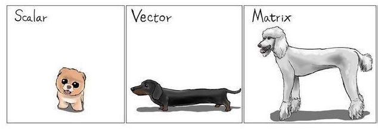

# Matrices
Una matriz es un arreglo rectangular de datos del mismo tipo. **Solo del mismo tipo**. Está compuesta tanto de columnas como de renglones. 

## Creación de matrices
Para crear una matriz podemos usar la función `matrix()`. Dicha función requiere de, al menos, un vector e indicar al menos una dimensión.

Ejemplo: 
```{r}
y <- matrix(c(1,5,8,-4), nrow=2, ncol=2) #nrow: indica el número de renglones & ncol: indica el número de columnas. 
y
```
Por default, la matriz va agregando los datos por columnas. 


```{r}
z <- matrix(c(TRUE, FALSE,rep(c(TRUE, FALSE),3)),nrow=4)
z
```
¿Por qué sólo es necesario indicar una dimensión (renglones)?


También se puede indicar que se cambien el orden de llenado de la matriz, es decir, en lugar de que lo haga por columnas, lo haga por renglones. 

```{r}
m <- matrix(c(1,2,3,4,5,6),nrow=2,byrow=TRUE)
m
```

 
## Dimensiones de un matriz
La dimensión de una matriz es el número de renglones y de columnas respectivamente. Se puede obtener usando la función `dim()` de *dimensión*. 
**NOTA** 
`dim()` no se puede emplear en elementos unidemsionales (Ej: vectores)

```{r}
dim(y)
dim(z)
```

Así una matriz se distingue de un vector ya que tiene, además de renglones, columnas. 


## Elementos de una matriz 

Para acceder a elementos de un objeto con *indices* (componentes que tienen una posición asignada), debemos usar *corchetes* `[]`. En el caso de la matriz se debe indicar la posición de ambas dimensiones `[renglón,columna]`.

Ejemplo: En este caso se desea seleccionar el elemento del primer renglón, segunda columna.

```{r}
y[1,2]
```
Ejemplo: En este caso se quiere seleccionar todos los elementos del primer renglón. 

```{r}
y[1,]
```

Ejemplo: En este caso se quiere seleccionar todos los elementos de la segunda columna. 

```{r}
y[,2]
```

## Creación de matriz "vacia"
Una forma **mucho menos eficiente** de definir una matriz es declarando una matriz sin elementos (matriz vacía) y después llenándolos de forma explícita asignando un valor distinto a cada posición. 

```{r}
 y <- matrix(nrow=2,ncol=2)
y[1,1] <- "Esta"
y[2,1] <- "es"
y[1,2] <- "una"
y[2,2] <- "matriz"
y
```

**Ejercicio** 

¿Cómo se llenaría una matriz vacia a partir de vectores?
¿El vector tendría que tener la misma longitud que la columna o el renglón de la matriz? 
¿Qué pasaría si la longitud del vector es diferente a la columna o renglón de la matriz? 
¿Cómo podrías emplear `cbind()` & `rbind()`?`
 
## Operaciones con matrices

### Multiplicación de un escalar con una matriz


```{r}
3*m
```

### Suma de dos matrices

```{r}
m + m
n<-matrix(c(2,3,4,5,6,7),ncol=3)
m+n
```

Para sumar matrices deben tener las mismas dimensiones

```{r}
dim(n)
dim(m)
(dim(n)-dim(m))==0
```

### Multiplicación de matrices

Se utiliza el operador `%*%`. Sí. Son tres caracteres. E incluyen dos `%`.
No hay espacios y es un sólo operador .

```{r}
n<-matrix(c(2,3,4,5,6,7),ncol=2)
n
m %*% n 
```

¿Recuerdas cuál es el criterio para calcular el producto de matrices?
¿Recuerdas cómo se multiplican dos matrices?


## Seleccionar elementos de matrices

Para seleccionar elementos de matrices se hace de forma análoga a vectores, es decir, se utiliza el operador `[]`. Sólo que esta vez hay que indicar tanto los renglones como la columna en ese orden

```{r}
m[2,3]  # Este es el segundo renglón tercera columna de m
n[3,2]  # Este es el elemento que está en el renglón 3 y columna 2 de la matriz n 
```

### Seleccionar todo(a) un(a) renglón(columna)

Para seleccionar todos los elementos de un renglón dado se utiliza la siguiente sintáxis

```{r}
m[2,]  # Todos los elementos que están en el segundo renglón
```

Para una columna 

```{r}
m[,3] # Toda la tercera columna
```

### Selecccionar elementos de una matriz

¿Qué hace lo siguiente?

```{r}
m[1:2,1]
m[1:2,2:3]
m[-1,]
m[-1,-c(1,3)]
```


## Nombres a renglones y columnas

Al igual que con vectores le podemos poner nombres tanto a renglones como a columnas para ello utilizamos `rownames()` y `colnames()`

```{r}
m   # No tengo nombres :(
```


```{r}
colnames(m)<-LETTERS[1:3]
rownames(m)<-letters[5:6]
```

```{r}
m   # Ahora sí. Feos, pero nombres :) :)
m["e","C"]
m["e","C"]==m[1,3]
```

